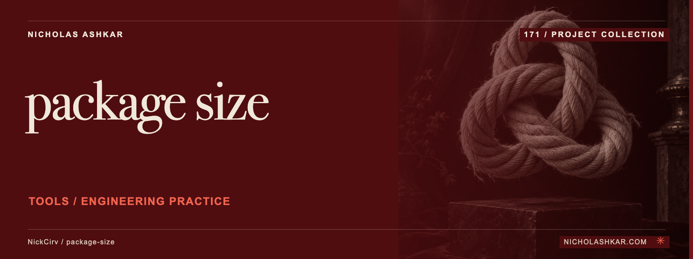

# package-size

Inspect the downloaded tarball size and unpacked file sizes of npm packages before installation.

Fetches registry metadata and package tarballs, reports the largest files and compares packages or recent versions. It reads archives without installing the package.


<a id="install"></a>

## Quickstart

Package runtime requirement: Node.js `>=20`. Git is needed to obtain this pinned source checkout.

```bash
git clone https://github.com/NickCirv/package-size.git
cd package-size
git checkout 866add0e84dd2cb85590a6553201fb45ae801805
node index.js --help
```

This source-derived example has not been executed in this review. Help is local. An analysis command downloads metadata and tarballs from the registry.


<a id="what-it-does"></a>

## Usage

```bash
node index.js lodash --json
node index.js react vue
node index.js axios --history
```

JSON output contains per-package measurements; history mode examines the last five selected versions.

[Command reference](docs/REFERENCE.md) covers arguments, modes and output controls.

## Behavior and limits

Package archive size is not browser bundle size and excludes the installed transitive dependency tree. The custom tar reader is not a complete archive auditing tool. Measurements depend on fetched registry versions and may change over time. Requests and archive processing were not exercised during this review.

## Development

Declared package scripts:

| Script | Command |
| --- | --- |
| `test` | `node --test` |

The smoke test syntax-checks the entrypoint; it does not exercise CLI behavior or integrations.

## Research

[Source review and claim ledger](docs/RESEARCH.md) records revision `866add0e84dd`, inspected files and verification gaps.

## License and attribution

Protected license and attribution files remain unchanged: [LICENSE](https://github.com/NickCirv/package-size/blob/866add0e84dd2cb85590a6553201fb45ae801805/LICENSE).

[Artwork credits](assets/nicholas-ashkar/CREDITS.md) · [Nicholas Ashkar — consulting](https://nicholashkar.com/#oxblood-contact)
